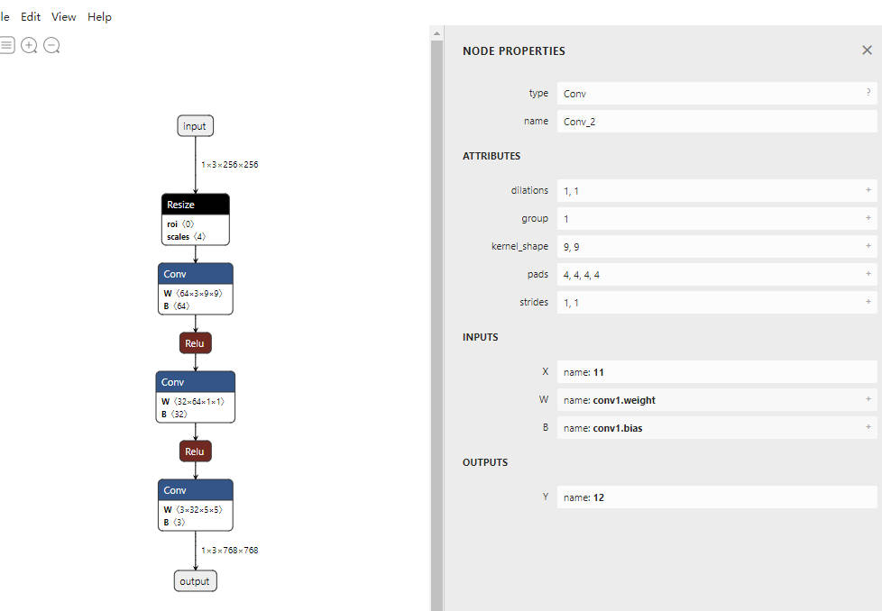
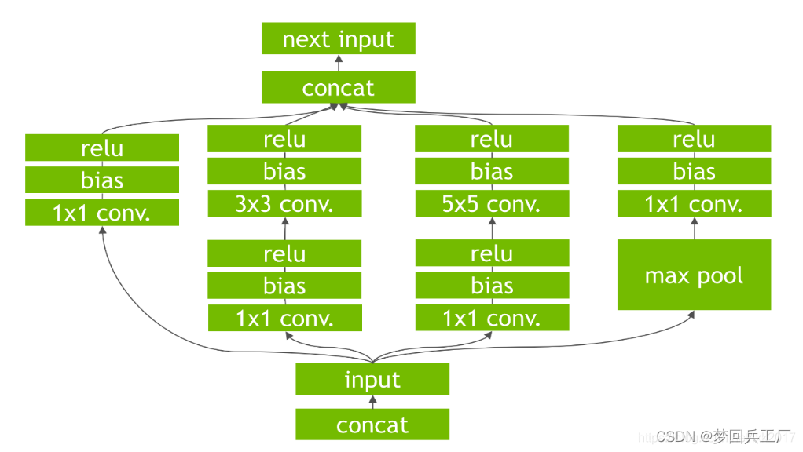
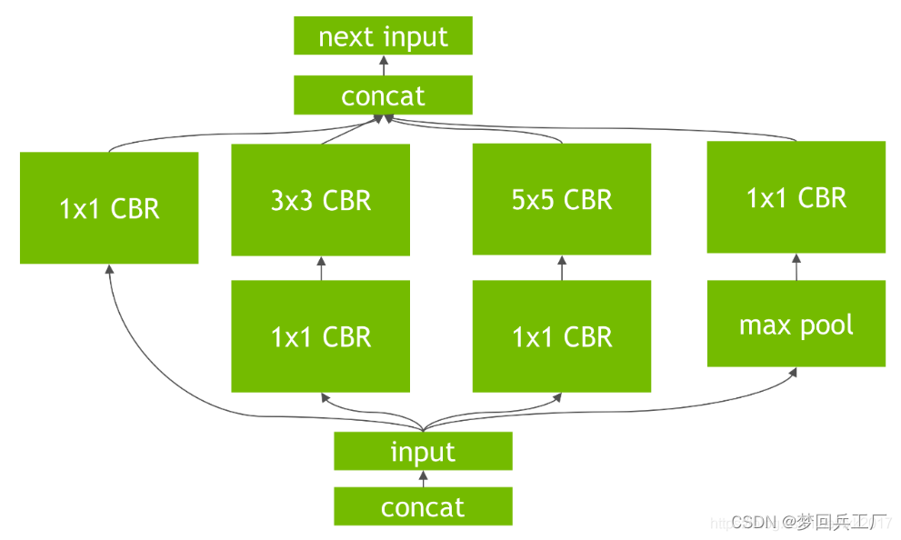

# 记录一下模型加速、部署、压缩相关

## 模型部署

### [openMMLab部署教程](https://github.com/open-mmlab/mmdeploy/blob/master/docs/zh_cn/tutorial/01_introduction_to_model_deployment.md)

#### ONNX

```
message Person { 
  required string name = 1; 
  required int32 id = 2; 
  optional string email = 3; 
} 
```

这段定义表示在Person这种数据类型中，必须包含 name、id 这两个字段，选择性包含 email字段。根据这份定义文件，用户就可以选择一种编程语言，定义一个含有成员变量name、id、email的Person 类，把这个类的某个实例用 Protobuf 存储成二进制文件；反之，用户也可以用二进制文件和对应的数据定义文件，读取出一个 Person类的实例。

而对于 ONNX ，Protobuf 的数据定义文件在其[开源](https://github.com/onnx/onnx/tree/main/onnx)，这些文件定义了神经网络中模型、节点、张量的数据类型规范；而二进制文件就是我们熟悉的“.onnx"文件，每一个 onnx 文件按照数据定义规范，存储了一个神经网络的所有相关数据。

我们日常用pytorch的是动态图，会比较慢，相当于走一步看一步，所以先将网络编译成静态图会快很多。

export 函数用的就是追踪导出方法，需要给任意一组输入，让模型跑起来。

```python
with torch.no_grad():
    torch.onnx.export(
        model,
        x,
        "srcnn.onnx",
        opset_version=11,
        input_names=['input'],
        output_names=['output'])
```

参数：1、要转的模型。  2、模型的输入。3、导出的onnx文件名。 4、opset_version 表示 ONNX 算子集的版本。 5 6、输入、输出 tensor 的名称。

ONNX转码原理：

```
从 PyTorch 的模型到 ONNX 的模型，本质上是一种语言上的翻译。直觉上的想法是像编译器一样彻底解析原模型的代码，记录所有控制流。但前面也讲到，我们通常只用 ONNX 记录不考虑控制流的静态图。因此，PyTorch 提供了一种叫做追踪（trace）的模型转换方法：给定一组输入，再实际执行一遍模型，即把这组输入对应的计算图记录下来，保存为 ONNX 格式。
```

检查模型格式是否正确

```
onnx.checker.check_model(model)
```

可视化：Netron

 

每个算子记录了算子属性、图结构、权重三类信息。

- 算子属性信息即图中 attributes 里的信息，对于卷积来说，算子属性包括了卷积核大小(kernel_shape)、卷积步长(strides)等内容。这些算子属性最终会用来生成一个具体的算子。

- 图结构信息指算子节点在计算图中的名称、邻边的信息。对于图中的卷积来说，该算子节点叫做 Conv_2，输入数据叫做 11，输出数据叫做 12。根据每个算子节点的图结构信息，就能完整地复原出网络的计算图。

- 权重信息指的是网络经过训练后，算子存储的权重信息。对于卷积来说，权重信息包括卷积核的权重值和卷积后的偏差值。点击图中 conv1.weight, conv1.bias 后面的加号即可看到权重信息的具体内容。


#### **ONNX Runtime**

推理引擎

```python
import onnxruntime

ort_session = onnxruntime.InferenceSession("srcnn.onnx")
ort_inputs = {'input': input_img}
ort_output = ort_session.run(['output'], ort_inputs)[0]

ort_output = np.squeeze(ort_output, 0)
ort_output = np.clip(ort_output, 0, 255)
ort_output = np.transpose(ort_output, [1, 2, 0]).astype(np.uint8)
cv2.imwrite("face_ort.png", ort_output)
```

**模型部署完成了！**

使用的时候只要安装onnx runtime就可以了,或者利用onnx runtime编译一个可执行的应用程序(SDK?)

#### [ONNX底层实现](https://www.cvmart.net/community/detail/6550)

[案例分析](https://blog.csdn.net/u012655441/article/details/120370892)

ONNX 在底层是用 Protobuf 定义的。Protobuf，全称 **Protocol Buffer**。使用 **Protocol Buffer**用户需要先写一份数据定义文件，再根据这份定义文件把数据存储进一份二进制文件。数据定义文件就是数据类，二进制文件就是数据类的实例。

一个节点的输入，要么是整个模型的输入，要么是之前某个节点的输出。

```python
##完全使用ONNX的API实现output = a*x+b
import onnx 
from onnx import helper
from onnx import TensorProto  #这里定义了protocol buffer

a = helper.make_tensor_value_info('a',TensorProto.FLOAT,[10,10])
x = helper.make_tensor_value_info('x', TensorProto.FLOAT, [10, 10]) 
b = helper.make_tensor_value_info('b', TensorProto.FLOAT, [10, 10]) 
output = helper.make_tensor_value_info('output', TensorProto.FLOAT, [10, 10]) 

mul = helper.make_node('Mul', ['a', 'x'], ['c']) 
add = helper.make_node('Add', ['c', 'b'], ['output']) 
graph = helper.make_graph([mul, add], 'linear_func', [a, x, b], [output]) 

model = helper.make_model(graph)#onnx.load() 
onnx.checker.check_model(model) 
print(model) 
onnx.save(model, 'linear_func.onnx') 
## 验证
import onnxruntime
import numpy as np
sess = onnxruntime.InferenceSession('linear_func.onnx')
a = np.random.rand(10,10).astype(np.float32)
x = np.random.rand(10,10).astype(np.float32)
b = np.random.rand(10,10).astype(np.float32)
output = sess.run(['output'],{'a':a,'b':b,'x':x})
print(output[0].shape)
```

 `helper.make_tensor_value_info(name,type,shape)`构造出一个描述张量信息的 `ValueInfoProto` 对象

`helper.make_node('Mul', ['a', 'x'], ['c'])`构造算子节点信息 `NodeProto`，这可以通过在 ,算子类型、输入算子名、输出算子名

`helper.make_graph([mul, add], 'linear_func', [a, x, b], [output]) ` 来构造计算图 **GraphProto**,需要传入节点、图名、输入张量、输出张量。注意：**节点要按拓扑结构输入**

`helper.make_model(graph)`把计算图 `GraphProto` 封装进模型 `ModelProto`

`onnx.checker.check_model`检查onnx是否符合标准

`onnx.utils.extract_model`子模型提取的函数，它的参数分别是原模型路径、输出模型路径、子模型的输入边（输入张量）、子模型的输出边（输出张量）

## TensorRT

### 简介

Tensor是一个有助于在NVIDIA图形处理单元（GPU）上高性能推理c++库。它旨在与TesnsorFlow、Caffe、Pytorch以及MXNet等训练框架以互补的方式进行工作，专门致力于在GPU上快速有效地进行网络推理。

衡量软件的关键因素：

* 吞吐量
* 效率
* 延迟性
* 准确性
* 内存使用情况

在训练了神经网络之后，**TensorRT**可以对网络进行压缩、优化以及运行时部署，并且没有框架的开销。**TensorRT**通过combines layers，kernel优化选择，以及根据指定的精度执行归一化和转换成最优的matrix math方法，改善网络的延迟、吞吐量以及效率。

### 加速原理：

#### 1、降低数据精度
模型训练通常使用 32 位或 16 位数据。而**TensorRT**支持kFLOAT（float32）、kHALF（float16）、kINT8（int8）三种精度的计算。**可以通过低精度进行网络推理，达到加速的目的**。但是该方法，会对推理精度有一定影响。

#### 2、模型压缩
**TensorRT**对网络结构进行重构，把一些能合并的运算合并在一起，从而进行加速。合并方式主要为以下两种：
	1）垂直合并

   * 垂直方向，合并一些网络层。例如，把Conv、BN、Relu三个层融合为一个层CBR。

     **conv**: $$\hat x = W_{conv}x+b_{conv}$$

     **BN**:    $$y = (\hat x - \frac{\hat x_{mean}}{\sqrt{(\hat x_{var}}  + \varepsilon)}) * \gamma + \beta = W_{bn}\hat x+b_{bn}$$

     **ReLU**:$$\hat y = max\{0,y\} = max\{0,W_{bn}(W_{conv}x+b_{conv})+b_{bn}\} = max\{0,W_{bn}W_{conv}x+W_{bn}b_{conv}+b_{bn}\}$$

​	2）水平合并

* 将输入为相同张量和执行相同操作的层融合在一起。

  

​	

#### 3、内核自动调整

根据不同的显卡构架、SM数量、内核频率等(例如1080TI和2080TI)，选择不同的优化策略以及计算方式，寻找最合适当前构架的计算方式

#### 4、动态张量显存

我们都知道，显存的开辟和释放是比较耗时的，通过调整一些策略可以减少模型中这些操作的次数，从而可以减少模型运行的时间

#### 5、多流执行

使用CUDA中的stream技术，最大化实现并行操作

### TensorRT适用于那些地方

#### 三个阶段

通常，开发和部署一个深度学习模型的工作流程分为了**3个阶段**：

- 第一个阶段是**训练模型**【在该阶段一般都不会使用TensorRT训练任何模型】

  在训练阶段，通常会先确定自己需要解决的问题，网络的输入输出，以及网络的损失函数，然后再设计网络结构，接下来就是根据自己的需求去整理、扩充training data，validation data and test data。在训练模型的过程中，我们一般都会通过监视模型的整个训练流程来确定自己是否需要修改网络的损失函数、训练的超参数以及数据集的增强。最后我们会使用validation data对trained model进行性能评估。需要注意的是，在该阶段一般都不会使用TensorRT训练任何模型。

- 第二个阶段是开发一个**部署解决方案**

  在这个阶段，我们将会通过使用trained model来创建和验证部署解决方案，该阶段分为以下几个步骤：

  1、首先需要考虑清楚神经网络在系统中是如何进行工作的，根据需求中的优先事项设计出适应的解决方案。另一方面，由于不同系统之间存在多样性的原因，我们在设计和实现部署结构时需要考虑很多方面的因素。【例如，是单个网络还是多个网络，需要哪些后处理步骤等等之内的因素】

  2、当设计好解决方案后，我们便可以使用**TensorRT**从保存的网络模型中构建一个**inference engine**。由于在training model期间可以选择不同的framework，因此，我们需要根据不同框架的格式，使用相应的解析器将保存的模型**转换为TensorRT的格式**。

  3、model解析成功后，我们需要考虑**优化选项**——batch size、工作空间大小、混合精度和动态形状的边界，这些选项被选择并指定为TensorRT构建步骤的一部分，在此步骤中，您将基于网络构建一个**优化的推理引擎**。

  4、使用TensorRT创建inference engine后，我们需要验证它是否可以**复现原始模型的性能评估结果**。如果我们选择了FP32或FP16，那么它与原始结果非常接近。如果选择了INT8，那么它与原始的结果会有一些差距。

  5、一序列化格式保存inference engine-----called plan file

- 第三个阶段是使用开发的解决方案进行**部署**【即使用阶段2中的解决方案来进行部署】

  该**TensorRT**库将被链接到**部署应用程序**，当应用程序需要一个推理结果时将会调用该库。为了初始化inference engine，应用程序首先会从plan file中反序列化为一个inference engine。另一方面，TensorRT通常是**异步使用**的，因此，当输入数据到达时，程序调用带有输入缓冲区和TensorRT放置结果的缓冲区的enqueue函数。

  

  **总的来说就是正常训模型----->用TensorTR将网络转成对应的inference engine（类似om?）----->设计优化选项(batchsize,精度)----->验证性能、精度，不行就调优**

### 功能

* 网络可以直接从**Caffe**导入，也可以通过**UFF**(貌似是转换tensorflow的)或**ONNX**格式从其他框架导入，也可以通过实例化各个图层并直接设置参数和weight以编程的方式创建。

* 可以通过**TensorRT**使用**Plugin interface**运行自定义图层。

[*参考*](https://zhuanlan.zhihu.com/p/356072366)

[*TensorRT详细入门指北，如果你还不了解TensorRT，过来看看吧！*](https://zhuanlan.zhihu.com/p/371239130)

## 

## 模型压缩

模型压缩是**对已经训练好的深度模型进行精简，进而得到一个轻量且准确率相当的网络**，压缩后的网络具有更小的结构和更少的参数，可以有效降低计算和存储开销，便于部署在受限的硬件环境中。
训练的时候因为要保证前后向传播，每次梯度的更新是很微小的，这个时候需要相对较高的精度，一般来说需要float型，如FP32，32位的浮点型来处理数据，但是在推理（Inference）的时候，对精度的要求没有那么高，很多研究表明可以用低精度，如半长（16）的float型，即FP16，也可以用8位的整型（INT8）来做推理（Inference）。所以，一般来说，在模型部署时会对模型进行压缩。模型压缩方法有：蒸馏，剪枝，量化等。

## **模型推理和前后处理**

**前处理**：因为模型推理的输入是Tensor（多维矩阵）数据，但是正常AI应用的输入都是图片，视频，文字等数据，**所以前处理就是要将业务的输入数据（图像，视频，文字等）预先处理成模型推理可以接收的数据---Tensor（多维矩阵）**。以图像处理为例，前处理动作就包括但不限于：图像格式转换，颜色空间变换，图像变换（resize，warpaffine（仿射变换）），图像滤波等操作。

**模型推理**：模型推理应该是模型部署pipline中最核心的部分。就是需要在实际应用环境中（具体部署设备）将实际输入的数据（转换成Tensor数据后）在训练好的模型中**跑通**，并且性能和精度等商业指标上达到预期效果。这个过程包括了对部署设备的适配（CPU/GPU/DSP/NPU），要想将模型跑在任何一种设备上，都需要提前针对设备进行适配，并且还要保证性能和精度等指标。这是个非常复杂的过程，后续希望出文章详细介绍

市面上有非常多的开源深度学习推理框架都是在解决模型推理相关的问题。例如：国内各大厂推出的开源的推理框架：OpenPPL、NCNN、TNN、MNN、PaddleLite、Tengine等等，还有NVIDIA推出的针对GPU卡的TensorRT、intel针对intel芯片的OpenVINO等。

**后处理**：就是将模型推理后的Tensor数据转换成业务可以识别的特征数据（不同的业务会呈现不同的最终效果数据）。

